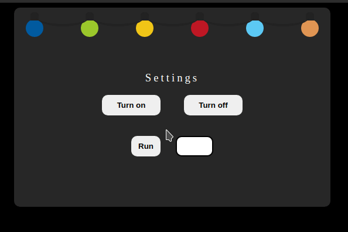

<h1 align="center"> Christmas Light 🎄 </h1>

  <a href="#-projeto">Projeto</a>&nbsp;&nbsp;&nbsp;|&nbsp;&nbsp;&nbsp;
  <a href="#%EF%B8%8F-tecnologias">Tecnologias</a>&nbsp;&nbsp;&nbsp;|&nbsp;&nbsp;&nbsp;
  <a href="#-funcionalidades">Funcionalidades</a>&nbsp;&nbsp;&nbsp;|&nbsp;&nbsp;&nbsp;
  <a href="#%EF%B8%8F-autor">Autor</a>&nbsp;&nbsp;&nbsp;|&nbsp;&nbsp;&nbsp;
  <a href="#-licen%C3%A7a">Licença</a>

 

  

 

### 💡 Projeto

O usuário tem a capacidade de ligar, desligar e alterar a velocidade com que as luzes natalinas piscam.

### ⚙️ Tecnologias

- [Javascript](https://developer.mozilla.org/pt-BR/docs/Web/JavaScript)
- [CSS](https://developer.mozilla.org/pt-BR/docs/Web/CSS)
- [HTML](https://developer.mozilla.org/pt-BR/docs/Web/HTML)

### 🔨 Funcionalidades

- [x] O usuário pode pressionar um botão para iniciar e parar a exibição
- [x] O usuário pode alterar o intervalo de tempo controlando a mudança na intensidade

### ✒️ Autor

👤 **Gabriel Henrique**

- Github: [@Gabriek0](https://github.com/Gabriek0)
- LinkedIn: [@gabriel-henrique-664bb219a](https://www.linkedin.com/in/gabriel-henrique-664bb219a/)

### 📜 Licença

- 
